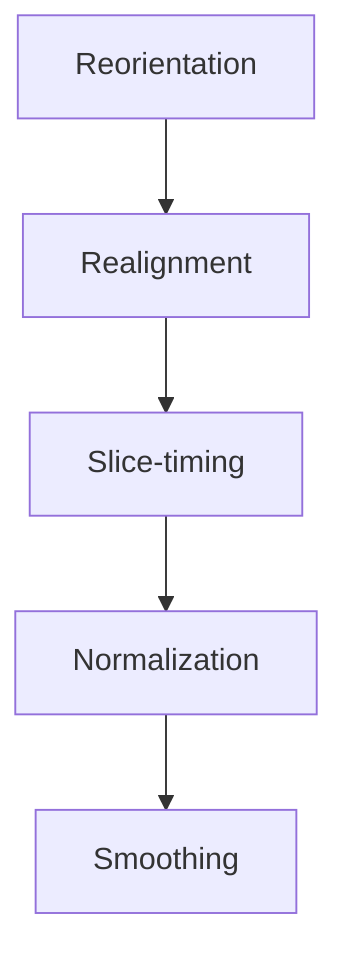
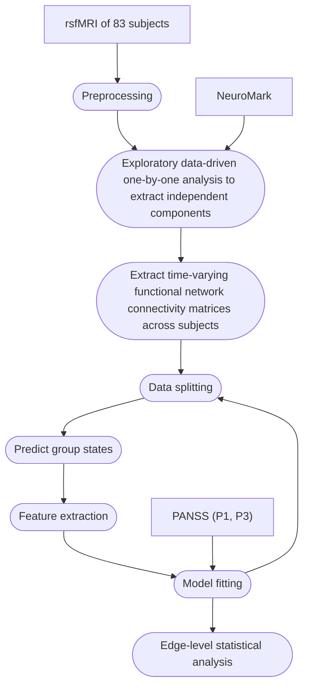

# A convergent multi-approach dCF analysis of intrusive symptoms in schizophrenia
This is a fully reproducible pipeline, including all the code, the applied dataset, the state centroids as signatures, and the execution instructions to run the code, for our proposed convergent multi-approach study, submitted to Scientific Reports. We aimed to decode aberrant dFC patterns of intrusive symptoms in schizophrenia. For this study, SPM12 (https://www.fil.ion.ucl.ac.uk/spm/software/spm12/) and the Group ICA/IVA of fMRI Toolbox (GIFT) v4.0.6.0 (https://github.com/trendscenter/gift) MATLAB (R2024b) were used for preprocessing and data-driven biomarker development, respectively. In addition, Python 3.13.3 was employed to implement the machine-learning part. Any version of these toolboxes can be applied, provided that it is compatible with your computing device. Throughout the multi-step implementation of the whole pipeline, the data are generated from multiple inputs and integrated into the underlying computational processes, which one assumes to know well how to work with different MATLAB neuroimaging toolboxes (such as SPM, GIFT, ICA, dFNC) and coding (Python). Here is the step-by-step instructions to fully reproduce the proposed data-driven pipeline:

## Preprocessing

Collect rsfMRI data, including clinical measures (PANSS scores), from 83 patients and 89 healthy controls from the COINS repository, as shown in Video 1.mp4. However, we have already compiled data to make the process more convenient, so users do not have to start from scratch to preprocess rsfMRI, though it is highly recommended to do preprocessing steps from scratch for reproducibility. The final step is smoothing, and the 172 smoothed time series data are available at https://drive.google.com/drive/folders/1eW4KuouGnV757rmgPs11CL2EsEiJ_9gN for use in the exploratory analysis described in the next section. 

Launch SPM and follow a simple workflow as described below: 



Reorient images in SPM12 using the T1 template (Single_subj_T1.nii). Realign volumes to the mean EPI with a two-pass correction (quality = 0.9, sep = 4 mm, FWHM = 5 mm, B-spline). Quantify motion via Framewise Displacement. Apply slice-timing correction (ref = 12; TA = 1.94 s, TR = 2 s, S = 33). Normalize to MNI space (avg152T1.nii; 3 mm isotropic) and smooth (8 mm FWHM). Verify QC (motion, normalization, timing, artifacts, signal stability).

## Exploratory data-driven analysis

Here is the overall data workflow of the proposed approach applied in the study:



Launch GIFT in MATLAB and run the spatial reference-based (constrained) ICA toolbox to decompose independent components using NeuroMark template v1.0, providing spatial priors. Then, run the dFNC toolbox and select the following parameter file obtained from cICA algorithm. As of this step ahead, all the functions required to reproduce the pipeline are stored at ```cod/mtlb``` folder. 

```
gr_ica_parameter_info.mat

```

Then a menu will pop up, and the functional network domains, along with their associated components, should be added based on their relevance to the research question. Three domains from NeuroMark v.1.0–SC (five ICNs; 1–5), CC (seventeen ICNs; 26–42), and DMN (seven ICNs; 43–49)– suggested by the literature are chosen based on their relevance to intrusive thoughts. During the preprocessing setup, the subject–level FNC mean over time is removed, and the corresponding option should be selected. The window size is set to 20 TRs, while the step size remains at its default value of three. Before post–processing, the training folds should be prepared by running the script below in command window of MATLAB:

```
prepare_training_folds.m
```

This process generates 𝑁 = 83 dFNC parameter files, which are subsequently used in ascending order in each CV iteration. For each CV iteration, perform post–processing and select thecorresponding adjusted dFNC parameter file from the list (e.g., ``` 1.mat ``` for the first iteration, ``` 2.mat ``` for the second, and so on). The following clustering parameters are set to their default values for all iterations: 

* No of k–means clusters = 4, Cluster options:
* Maximum number of iterations = 5000
* Distance method = “correlation”
* Clustering iterations = 50
* Number of reference datasets to calculate gap = 50
* Initialization of the k–means = “Subject exemplars”.
* The state–guided ICA of dFNC is also disabled.

Next, repeat the clustering using the default input parameters until no subject has zero state transitions and all subjects have utilized all states in their sequences. In some CV iterations, it may be necessary to increase the maximum number of clustering iterations or adjust certain parameters to satisfy this condition. To verify whether the condition is met, use the script below: 

```
states_into_matrix.m
```

If the condition is satisfied, an output file named ``` seq*.mat  ``` will be generated, where ‘*’ corresponds to the CV iteration. Each ``` seq*.mat ``` file contains the four cluster centroids (c) and a matrix (x) representing the sequence of states for all training subjects within the training set of a given CV iteration. Ultimately, a total of 83 ``` seq*.mat ``` files were generated, which were used to extract features. To identify the indices and the number of edges within each domain in the windowed matrices, ``` icatb_vec2mat.mat ``` function is used, which can be found within the GIFT directory. It transforms the correlation vectors in FNCdyn variable from each ``` gr_dfnc_sub_*_sess_001_results.mat ``` , where ‘*’ is the subject number file, back into separate matrices for easier inspection and analysis. Figure 37 illustrates the indices corresponding to each of the three domain–to–domain pairwise connections. Specifically, the green, pink, and orange blocks represent the SC–CC, SC–DM, and CC–DM connections, respectively.

After that, run ``` avrg_node.m ``` script in the command window to compute the average connectivity strength of the edges within each specific domain. Use the following script to extract state–wise features:

```
feature_ext.mat
```

Given that there are four cluster centroids with three domain–to–domain edges (𝑒 = 3; corresponding to SC–CC, SC–DM, and CC–DM), the total number of features is calculated as 𝑚 = 𝑘 × 𝑒, 𝑚 = 12, where 𝑘 represents the number of states. These 𝑘 × 𝑒 predictors correspond to the state–based features extracted. In this process, there are 83 training folds, each
associated with a state transition matrix {𝑋<sub>1</sub>, 𝑋<sub>2</sub>..., 𝑋<sub>83</sub>}. Each 𝑋<sub>i</sub> consists of 82 state vectors, and each vector contains 130 states, which is equal to the number of dFNC windows. A total of 83 datasets, each representing a fold with a size of 82 by 12, are generated and saved in ``` folds.mat ```. The function ``` compute_dist_test.m ``` labels the windows of dFNC_test with their corresponding states. Run it in command window to compute twelve state–wise edge mean values. This step produces 83 one–dimensional vectors, each with a length of 12. The fourth column of ``` dfnc_ts.mat ``` contains the results of this stage. It is important to note that for test samples that do not visit certain states within their sequence, the corresponding elements in the array—specifically, the three edge values associated with the missing state—are assigned zeros.

Finally, save the target variables, including HB and Del, and their corresponding newly defined categories, as a single CSV file and label ``` targets.csv ```, and apply the following script to generate 83 training and 83 testing folds (166 files in total)

```
savetocsv.m 
```

The script also performs Z–score normalization of the data within each iteration of the loop. After this preparation, 83 folds are generated, as shown in the data folder (r). Launch a Python IDE and run ``` main.py ```, then adjust the input path to the obtained folds, which is set to ``` /Users/r ``` by default. After XGBoost modeling, the significant state is identified, allowing us to identify intra–state trends. Use ``` significant_state_analysis.m ``` to perform the edge set two— sided permutation analysis to obtain effect sizes and FDR—adjusted p—values. To do so, cutoffs are properly applied in accordance with best practices to identify the most significant edge(s).


